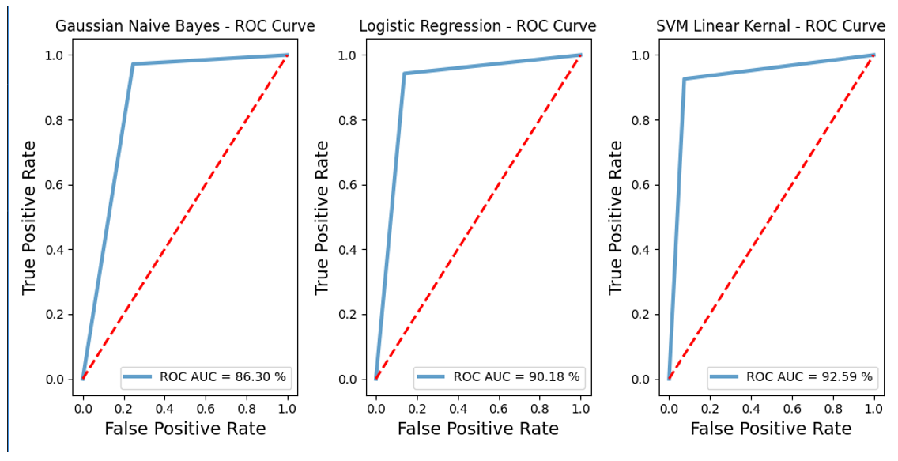

## Finding-Best-Classifier
This Data Science Project makes an attempt to predict whether a given R,G,B color parameters is either "skin" or "non-skin".
I make an attempt to find what the best parameters are for each classifier then train another instance of the classifier with the best parameter to acheive the best results.
Technologies/dependencies used: Numpy, Pandas, sci-kit learn (model_selection,metrics,svm), time, Matplotlib 
Finding the best Classifier to train the model with to achieve the highest prediction rate, Classifiers being used are SVM , Logestic Regression and Gaussian Naive Bayes

## Dataset

Skin Segmentation Data Set from the UCI Machine Learning Repository. The skin dataset is collected by randomly sampling B, G, and R values from face images of various age groups, race groups, and genders obtained from FERET database and PAL database. (Skin Segmentation Data Set, 2012) There are over 245,000 samples in the data set – 50,000 are skin samples and 195,000 are non-skin samples. The Data was split into 70 - 30 train-test split. 

## Data Set Info 

The first three columns B, G, and R indicate values from the RGB color space.  
Column 4 contains the class labels. 

Cross-validation was implemented in all 3 algorithms to find the optimal parameters this was done using GridSearchCV() 
The time to compute the GridSearchCV() was immensely improved by creating threads using the n_jobs attribute   

### Results
## ROC Curves 

## Gaussian Naive Bayes: Computation Times, Best Parameter/s and Confusion Matrix

## Logistic Regression: Computation Times, Best Parameter/s and Confusion Matrix

## Support Vector Machine(Linear) : Computation Times, Best Parameter/s and Confusion Matrix

